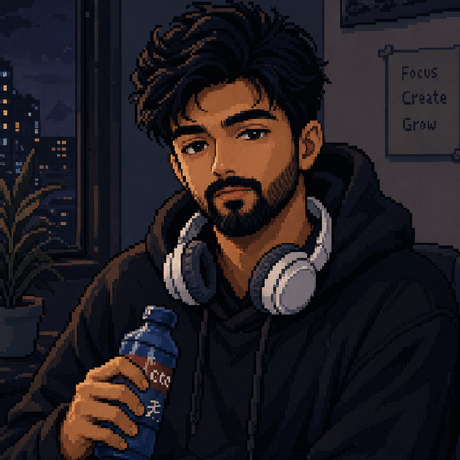

  
  <!-- Premium Header Bar -->
  <table width="100%" border="0" cellpadding="0" cellspacing="0" style="border-collapse: collapse; border-spacing: 0px; border: none; font-family: monospace;">
    <tr style="border: none; background: transparent;">
      <td align="left" style="border: none; padding: 10px; color: #3fb950; font-size: 11px; font-weight: bold;">
        🟢 SYSTEM STATUS: ACTIVE // HOST: BVD_MURALI_AI
      </td>
      <td align="right" style="border: none; padding: 10px; color: #8b949e; font-size: 11px;">
        LOCATION: INDIA // TIMEZONE: GMT+5:30
      </td>
    </tr>
  </table>
  

---

<!-- Hero Panel Grid (2 Columns) -->
<table width="100%" border="0" cellpadding="0" cellspacing="0" style="border-collapse: collapse; border: none;">
  <tr style="border: none; background: transparent;">
    <!-- Left Column: Portrait & Title -->
    <td width="55%" valign="top" style="border: none; padding-right: 20px;">
      <h1 align="left">BODDETI VEERA DURGA MURALI</h1>
      <h3 align="left">AI & MACHINE LEARNING ENGINEER</h3>
      

        Building intelligent, production-grade systems with NLP, LLMs, Agentic AI, and scalable MLOps architectures.
      

       
      

        
        
      

       
      <!-- Core tags -->
      

        <code>Python</code> &nbsp;•&nbsp; 
        <code>TensorFlow</code> &nbsp;•&nbsp; 
        <code>Azure OpenAI</code> &nbsp;•&nbsp; 
        <code>LangChain</code> &nbsp;•&nbsp; 
        <code>RAG</code> &nbsp;•&nbsp; 
        <code>Agentic AI</code>
      

    </td>
    <!-- Right Column: Avatar/Visualizer -->
    <td width="45%" align="center" valign="middle" style="border: none; padding-left: 20px;">
      
        
      <code style="font-size: 10px; color: #8b949e;">[PORTRAIT_DECRYPTED]</code>
    </td>
  </tr>
</table>

---

## 📊 Live Metrics & Statistics

<table width="100%" border="0" cellpadding="0" cellspacing="0" style="border-collapse: collapse; border: none;">
  <tr style="border: none; background: transparent;">
    <td width="50%" valign="top" style="border: none; padding-right: 10px;">
      
    </td>
    <td width="50%" valign="top" style="border: none; padding-left: 10px;">
      
    </td>
  </tr>
</table>

---

## ⚙️ Main Dashboard Panel

<table width="100%" border="0" cellpadding="0" cellspacing="0" style="border-collapse: collapse; border: none;">
  <tr style="border: none; background: transparent;">
    
    <!-- Left Column: About & Research -->
    <td width="48%" valign="top" style="border: none; padding-right: 15px;">
      <h3>🧠 About Me</h3>
      <ul>
        <li><b>Large Language Models:</b> Focused on building pipeline wrappers and custom prompt execution logic.</li>
        <li><b>Retrieval-Augmented Generation:</b> Expert in semantic indexing, embeddings, and vector database queries.</li>
        <li><b>Agentic AI Systems:</b> Engineering multi-step, autonomous systems with logical loops and tool-execution modules.</li>
        <li><b>NLP & Conversational AI:</b> Building intent classifiers and entity extraction models for reliable user routing.</li>
        <li><b>Production AI:</b> Designing scalable cloud endpoints, robust containerization, and automated workflows.</li>
      </ul>
      
       
      
      <h3>🔬 Research Interests</h3>
      <table>
        <tr style="background: transparent;">
          <td style="padding: 6px; font-size: 12px; border: 1px solid #30363d;">🛸 <b>Agentic AI</b></td>
          <td style="padding: 6px; font-size: 12px; border: 1px solid #30363d;">📂 <b>RAG Architecture</b></td>
        </tr>
        <tr style="background: transparent;">
          <td style="padding: 6px; font-size: 12px; border: 1px solid #30363d;">⚙️ <b>LLM Fine-Tuning</b></td>
          <td style="padding: 6px; font-size: 12px; border: 1px solid #30363d;">🛡️ <b>Responsible AI</b></td>
        </tr>
        <tr style="background: transparent;">
          <td style="padding: 6px; font-size: 12px; border: 1px solid #30363d;">📊 <b>Rec Systems</b></td>
          <td style="padding: 6px; font-size: 12px; border: 1px solid #30363d;">📈 <b>Predictive Models</b></td>
        </tr>
      </table>
    </td>
    
    <!-- Right Column: Tech Stack Matrix -->
    <td width="52%" valign="top" style="border: none; padding-left: 15px;">
      <h3>🛠️ AI Engineering Stack</h3>
      
      <table width="100%">
        <tr style="background: transparent;">
          <th align="left" style="font-size: 12px; padding: 8px; border: 1px solid #30363d; color: #58a6ff;">🧠 MACHINE LEARNING</th>
        </tr>
        <tr style="background: transparent;">
          <td style="padding: 8px; border: 1px solid #30363d;">
            
            
            
            
             
            
            
          </td>
        </tr>
        
        <tr style="background: transparent;">
          <th align="left" style="font-size: 12px; padding: 8px; border: 1px solid #30363d; color: #bc8cff;">💬 LLM ENGINEERING</th>
        </tr>
        <tr style="background: transparent;">
          <td style="padding: 8px; border: 1px solid #30363d;">
            
            
            
            
             
            
            
          </td>
        </tr>
        
        <tr style="background: transparent;">
          <th align="left" style="font-size: 12px; padding: 8px; border: 1px solid #30363d; color: #58a6ff;">⚙️ MLOPS</th>
        </tr>
        <tr style="background: transparent;">
          <td style="padding: 8px; border: 1px solid #30363d;">
            
            
            
            
          </td>
        </tr>
        
        <tr style="background: transparent;">
          <th align="left" style="font-size: 12px; padding: 8px; border: 1px solid #30363d; color: #bc8cff;">☁️ CLOUD ARCHITECTURE</th>
        </tr>
        <tr style="background: transparent;">
          <td style="padding: 8px; border: 1px solid #30363d;">
            
            
             
            
            
          </td>
        </tr>
      </table>
    </td>
    
  </tr>
</table>

---

## 📂 Featured AI Projects

<table width="100%" border="0" cellpadding="0" cellspacing="0" style="border-collapse: collapse; border: none;">
  <tr style="border: none; background: transparent;">
    
    <!-- Card 1: RAG -->
    <td width="50%" valign="top" style="border: 1px solid #30363d; padding: 15px; border-radius: 8px;">
      
<code style="font-size: 10px; color: #3fb950; border: 1px solid #238636; padding: 2px 6px; border-radius: 4px;">PRODUCTION</code>

      <h4>📂 Enterprise RAG System</h4>
      

        A high-efficiency semantic query pipeline resolving queries on unstructured company databases. Integrates caching and vector search optimization.
      

      
        <code>LangChain</code> • <code>Vector DB</code> • <code>OpenAI</code> • <code>Knowledge Search</code>
      
    </td>
    
    <!-- Card 2: Prompt Pilot -->
    <td width="50%" valign="top" style="border: 1px solid #30363d; padding: 15px; border-radius: 8px;">
      
<code style="font-size: 10px; color: #58a6ff; border: 1px solid #388bfd; padding: 2px 6px; border-radius: 4px;">STABLE</code>

      <h4>📂 Prompt Pilot</h4>
      

        Visual hub for prompt versioning, system template evaluations, parameter optimization runs, and workflow deployment triggers.
      

      
        <code>Prompt Engineering</code> • <code>LLM Evaluation</code> • <code>AI Workflows</code>
      
    </td>
    
  </tr>
  <tr style="border: none; background: transparent;">
    
    <!-- Card 3: Jarvis -->
    <td width="50%" valign="top" style="border: 1px solid #30363d; padding: 15px; border-radius: 8px;">
      
<code style="font-size: 10px; color: #bc8cff; border: 1px solid #8957e5; padding: 2px 6px; border-radius: 4px;">ACTIVE</code>

      <h4>📂 Project Jarvis</h4>
      

        Autonomous agent platform utilizing Azure OpenAI and Cosmos DB. Performs complex schedules, code sandbox self-debugging, and schema resolving.
      

      
        <code>Agentic AI</code> • <code>Azure OpenAI</code> • <code>Cosmos DB</code> • <code>Next.js</code>
      
    </td>
    
    <!-- Card 4: Chatbot -->
    <td width="50%" valign="top" style="border: 1px solid #30363d; padding: 15px; border-radius: 8px;">
      
<code style="font-size: 10px; color: #8b949e; border: 1px solid #30363d; padding: 2px 6px; border-radius: 4px;">COMPLETED</code>

      <h4>📂 University Chatbot</h4>
      

        NLP-driven routing bot classifying intent models and extracting entity keywords to answer structured campus registry datasets.
      

      
        <code>NLP</code> • <code>Intent Classification</code> • <code>Entity Recognition</code>
      
    </td>
    
  </tr>
</table>

---

## 📈 Impact Metrics & Certifications

<table width="100%" border="0" cellpadding="0" cellspacing="0" style="border-collapse: collapse; border: none;">
  <tr style="border: none; background: transparent;">
    
    <!-- Impact column -->
    <td width="50%" valign="top" style="border: none; padding-right: 15px;">
      <h3>⚡ Impact Metrics</h3>
      <ul>
        <li>🚀 <b>50%</b> API Latency reduction via response caching</li>
        <li>🔍 <b>40%</b> SQL query speedups by structural index tuning</li>
        <li>🎯 <b>30%</b> Accuracy improvement in semantic answer matching</li>
        <li>📦 <b>15+</b> Production features coded, tested, and released</li>
      </ul>
    </td>
    
    <!-- Certifications column -->
    <td width="50%" valign="top" style="border: none; padding-left: 15px;">
      <h3>🎓 Certifications</h3>
      <ul>
        <li>📜 <b>NPTEL Programming in Java</b> <code style="color: #3fb950; font-size: 10px;">VERIFIED</code></li>
        <li>📜 <b>SQL Basic</b> <code style="color: #3fb950; font-size: 10px;">VERIFIED</code></li>
        <li>📜 <b>SQL Intermediate</b> <code style="color: #3fb950; font-size: 10px;">VERIFIED</code></li>
        <li>🤖 <b>Deep Learning Specialization</b> <code style="color: #58a6ff; font-size: 10px;">IN_PROGRESS</code></li>
      </ul>
    </td>
    
  </tr>
</table>

---

   
  "Building AI Today for a Smarter Tomorrow" 
  <strong>BODDETI VEERA DURGA MURALI</strong>

